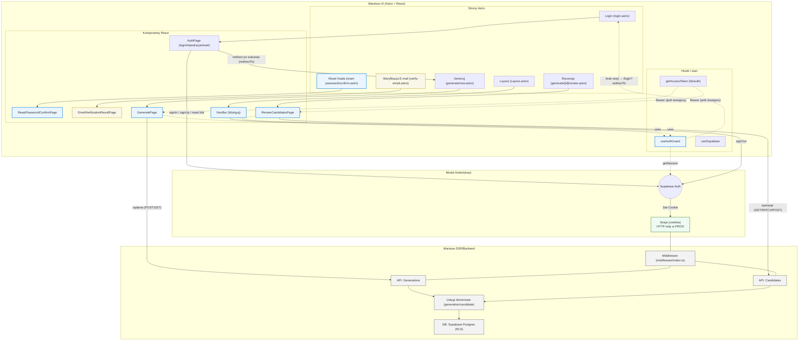

<architecture_analysis>
1) Komponenty i elementy związane z autentykacją (z kodu i specyfikacji):
- Strony Astro: `login.astro` (istnieje), `reset-password/confirm.astro` (nowa), `verify-email.astro` (opcjonalna), `generate/new.astro`, `generate/[id]/review.astro`, layout `src/layouts/Layout.astro`.
- Komponenty React: `AuthPage.tsx` (login/rejestracja/reset link), `ResetPasswordConfirmPage.tsx` (nowy), `EmailVerificationResultPage.tsx` (opc.), `NavBar.tsx` (Wyloguj), `GeneratePage.tsx` (US‑003), `ReviewCandidatesPage.tsx` (US‑004).
- Hooki/stany: `useAuthGuard` (client-side guard), `useSupabase` (klient w przeglądarce).
- Lib: `lib/auth.ts` (`getAccessToken`), `lib/schemas.ts` (Zod – walidacje API domeny), usługi: `generationService.ts`, `candidateService.ts`.
- Middleware: `src/middleware/index.ts` (tworzenie klienta Supabase, bez SSR‑redirectów), plan SSR: `@supabase/ssr` (HTTP‑only cookies w PROD).
- API (Astro routes): Generations/Candidates (bez wpisywania URL węzłów w diagramie).
- Supabase: Auth, Postgres (RLS), sesje (cookies).

2) Główne strony i ich komponenty:
- `/login` → `login.astro` → montuje `AuthPage` (React).
- `/reset-password/confirm` → `reset-password/confirm.astro` → montuje `ResetPasswordConfirmPage` (React).
- (opc.) `/verify-email` → `verify-email.astro` → montuje `EmailVerificationResultPage` (React).
- `/generate/new` → `generate/new.astro` → montuje `GeneratePage` (React) + `useAuthGuard`.
- `/generate/[id]/review` → `generate/[id]/review.astro` → montuje `ReviewCandidatesPage` (React) + `useAuthGuard`.
- `Layout.astro` → zawiera `NavBar` (Wyloguj).

3) Przepływ danych:
- AuthPage → Supabase Auth (signIn/signUp/reset) → Sesja w cookies (w PROD HTTP‑only, server‑managed) → redirect do `redirectTo`.
- `useAuthGuard` → sprawdza sesję przez Supabase SDK → redirect do `/login` gdy brak.
- Generate/Review → wywołują API (fetch, opcjonalnie Bearer z `getAccessToken`) → Middleware dołącza supabase do `context.locals` → Services → DB → odpowiedź → UI.
- NavBar „Wyloguj” → `supabase.auth.signOut()` → redirect do `/login`.

4) Krótkie opisy funkcji komponentów:
- AuthPage: formularze login/rejestracja/reset link z walidacją i komunikatami; redirect po sukcesie.
- ResetPasswordConfirmPage: ustawienie nowego hasła w sesji recovery; powrót do logowania.
- EmailVerificationResultPage (opc.): informuje o wyniku weryfikacji i kieruje do logowania.
- useAuthGuard: chroni widoki; przekierowuje niezalogowanych na `/login` z `redirectTo`.
- GeneratePage: uruchamia generację, lokalna walidacja tematu, obsługa błędów; wymaga sesji.
- ReviewCandidatesPage: pobiera generację + kandydatów; akceptuje/odrzuca/edytuje; wymaga sesji.
- NavBar: linki nawigacji, akcja Wyloguj.
- Middleware: tworzy klienta Supabase, zarządza cookies; bez SSR‑redirectów (zapobiega pętli).
</architecture_analysis>

<mermaid_diagram>

</mermaid_diagram>

