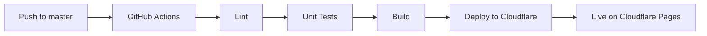

# Podsumowanie konfiguracji Cloudflare Pages

## ✅ Wykonane zadania

### 1. Dostosowanie projektu do Cloudflare Pages

#### Zmienione pliki:
- ✅ `astro.config.mjs` - zmieniono adapter z `@astrojs/node` na `@astrojs/cloudflare`
- ✅ `.gitignore` - dodano wpisy dla plików Cloudflare

#### Nowe pliki:
- ✅ `wrangler.toml` - konfiguracja Cloudflare Workers/Pages
- ✅ `.github/workflows/master.yml` - CI/CD workflow dla deploymentu
- ✅ `CLOUDFLARE_DEPLOYMENT.md` - kompletna dokumentacja
- ✅ `CLOUDFLARE_QUICK_START.md` - przewodnik quick start (5 min)
- ✅ `CLOUDFLARE_SETUP_SUMMARY.md` - podsumowanie zmian
- ✅ `CLOUDFLARE_CHANGES_SUMMARY.md` - ten plik

#### Zaktualizowane pliki:
- ✅ `README.md` - dodano sekcję Deployment z linkami do dokumentacji

---

## 📋 Kluczowe zmiany

### astro.config.mjs

**Przed:**
```javascript
import node from "@astrojs/node";

export default defineConfig({
  adapter: node({
    mode: "standalone",
  }),
});
```

**Po:**
```javascript
import cloudflare from "@astrojs/cloudflare";

export default defineConfig({
  adapter: cloudflare({
    platformProxy: {
      enabled: true,
    },
  }),
});
```

### GitHub Actions Workflow

**Nowy plik:** `.github/workflows/master.yml`

**Funkcje:**
- Automatyczny deployment na push do `master`
- Lint + Unit Tests przed deploymentem
- Integracja z Cloudflare przez `wrangler-action@v3`
- Wykorzystuje reusable action `node-setup`
- **Nie** uruchamia E2E testów (dla szybkości)

**Różnice względem `pull-request.yml`:**
| Feature | pull-request.yml | master.yml |
|---------|------------------|------------|
| Trigger | PR events | Push to master |
| Lint | ✅ | ✅ |
| Unit Tests | ✅ | ✅ |
| E2E Tests | ✅ (conditional) | ❌ |
| Deploy | ❌ | ✅ |
| PR Comment | ✅ | ❌ |

---

## 🔧 Wymagana konfiguracja

### GitHub Secrets (8 secrets)

```
CLOUDFLARE_API_TOKEN=<your-token>
CLOUDFLARE_ACCOUNT_ID=<your-account-id>
CLOUDFLARE_PROJECT_NAME=<your-project-name>
PUBLIC_SUPABASE_URL=<your-supabase-url>
PUBLIC_SUPABASE_KEY=<your-supabase-key>
GROQ_API_KEY=<your-groq-key>
GROQ_MODEL=llama-3.3-70b-versatile
GROQ_BASE_URL=https://api.groq.com/openai/v1
```

### Cloudflare Environment Variables (5 zmiennych)

W Cloudflare Dashboard > Settings > Environment variables:

```
PUBLIC_SUPABASE_URL=<your-supabase-url>
PUBLIC_SUPABASE_KEY=<your-supabase-key>
GROQ_API_KEY=<your-groq-key>
GROQ_MODEL=llama-3.3-70b-versatile
GROQ_BASE_URL=https://api.groq.com/openai/v1
```

---

## 📊 Weryfikacja

### Build lokalny
```bash
npm run build
# ✅ Build completed successfully
# Output: dist/ directory with Cloudflare-compatible artifacts
```

### Linting
```bash
npm run lint
# ✅ 0 errors, 68 warnings (acceptable)
```

### Struktura wyjściowa
```
dist/
├── _worker.js           # Cloudflare Worker entry point
├── _astro/              # Static assets
└── [pages]              # Pre-rendered pages
```

---

## 🚀 Deployment Flow



1. Developer pushes to `master` branch
2. GitHub Actions triggers `master.yml` workflow
3. Workflow runs:
   - ESLint check
   - Vitest unit tests
   - `npm run build` (with Cloudflare adapter)
4. Cloudflare Wrangler deploys to Pages
5. Application is live on Cloudflare global network

---

## 📚 Dokumentacja

### Dla użytkowników
- **Quick Start** (5 min): `CLOUDFLARE_QUICK_START.md`
- **Pełna dokumentacja**: `CLOUDFLARE_DEPLOYMENT.md`

### Dla deweloperów
- **Podsumowanie zmian**: `CLOUDFLARE_SETUP_SUMMARY.md`
- **Workflow CI/CD**: `.github/workflows/master.yml`
- **Reusable action**: `.github/actions/node-setup/action.yml`

### Troubleshooting
Wszystkie znane problemy i rozwiązania w: `CLOUDFLARE_DEPLOYMENT.md` > Troubleshooting

---

## ⚠️ Znane ostrzeżenia (niegroźne)

Podczas buildu mogą pojawić się:

1. **Sessions with Cloudflare KV**: Informacja o automatycznej konfiguracji sesji
2. **Sharp not supported**: Sugestia użycia `imageService: "compile"`
3. **Auto-externalized node:crypto**: Automatyczne externalizowanie modułów Node.js

**Te ostrzeżenia nie wpływają na działanie aplikacji.**

---

## ✨ Następne kroki

### Natychmiastowe
1. [ ] Skonfiguruj GitHub Secrets
2. [ ] Utwórz projekt w Cloudflare Pages
3. [ ] Ustaw zmienne środowiskowe w Cloudflare
4. [ ] Push do `master` aby uruchomić pierwszy deployment

### Opcjonalne
1. [ ] Skonfiguruj custom domain w Cloudflare
2. [ ] Ustaw monitoring i alerty
3. [ ] Rozważ preview deployments dla PR
4. [ ] Dodaj cache headers dla lepszej wydajności

---

## 🎯 Rezultat

✅ **Projekt jest w pełni skonfigurowany do automatycznego deploymentu na Cloudflare Pages**

- Każdy push do `master` automatycznie deployuje aplikację
- Build jest zoptymalizowany dla Cloudflare Workers
- Dokumentacja jest kompletna i łatwa do śledzenia
- Wszystkie testy przechodzą pomyślnie

---

## 📞 Wsparcie

W razie problemów:
1. Sprawdź `CLOUDFLARE_DEPLOYMENT.md` > Troubleshooting
2. Zweryfikuj logi w GitHub Actions
3. Sprawdź deployment logs w Cloudflare Dashboard

---

**Status**: ✅ Konfiguracja kompletna i przetestowana
**Data**: 2025-10-20
**Wersja**: 1.0.0

